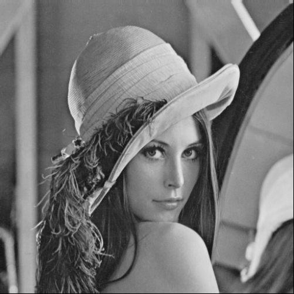
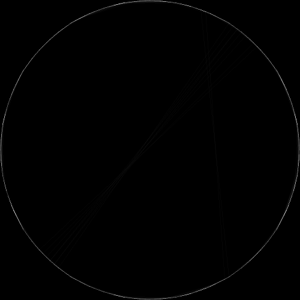
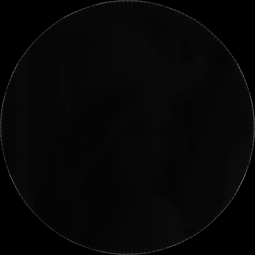
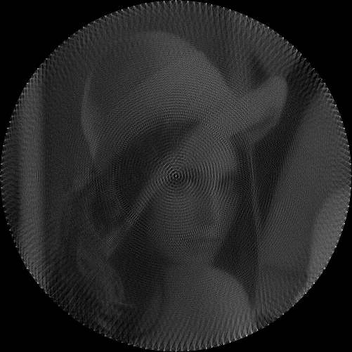
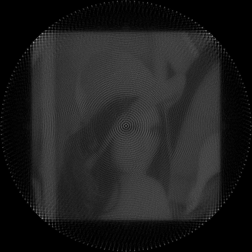

# String Art Generator

A Python project that recreates images using straight lines drawn between pegs placed on a circular frame — inspired by the work of Petros Vrellis.

This was created as a final project for ENGR5151UG (Computer Vision) in Spring 2023.

## Features

- Converts any image into a string art representation
- Uses Bresenham’s line algorithm to simulate string drawing
- Customizable number of pegs and lines
- Runs in Google Colab or locally

## Lenna Demo

Here are some of the variations generated from the Lenna image:

| Version                     | Output |
|----------------------------|--------|
| Original Lenna             |  |
| High-Contrast Version      |  |
| Blurred/Processed Version  |  |
| Unquantized                |  |
| Allow Negative Values      |  |
| Final String Art Result    |  |

## Getting Started

### Google Colab (Recommended)

1. Open the notebook in Google Colab.
2. Upload an image.
3. Run all cells to generate your string art.

### Local Setup

```bash
git clone https://github.com/YOUR_USERNAME/string-art-generator.git
cd string-art-generator
pip install -r requirements.txt
jupyter notebook
```

Then open the `.ipynb` file and run it step-by-step.

## Parameters

You can customize the following:

- `num_pegs`: Number of pegs placed in a circle (higher = better resolution)
- `num_lines`: Number of lines to draw
- `peg_selection`: Strategy for selecting pegs (random, sequential, or based on pixel intensity)

## Requirements

- Python 3.7+
- NumPy
- OpenCV
- Matplotlib
- scikit-image
- imageio
- PIL

Install dependencies with:

```bash
pip install -r requirements.txt
```

## References

- [Petros Vrellis Artwork](http://artof01.com/vrellis/works/knit.html)
- [Bresenham’s Algorithm](https://en.wikipedia.org/wiki/Bresenham%27s_line_algorithm)
- [Daniel Varga’s String Art](https://github.com/danielvarga/string-art)

## Project Presentation

Slides from the original class presentation are available in the [`assets/`](assets/) folder.

## License

This project is for educational use.
